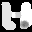
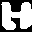
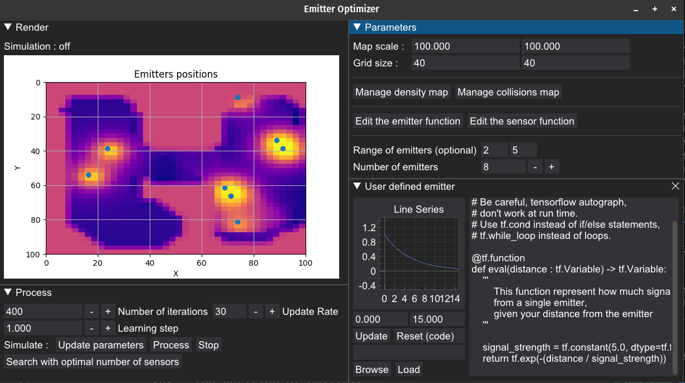
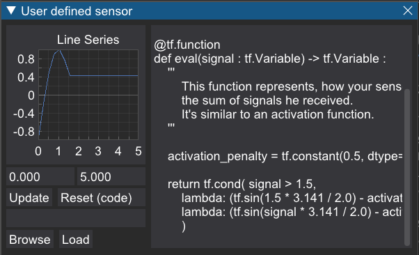

# Emitter Optimizer
Find the optimal emitters positions on a map using user defined emitter.

## Installation
- automatic install of dependencies :
```sh
./install_dependencies
```
- manual install of the dependencies :
```sh
pip install numpy tensorflow dearpygui
```
- condas install of the dependencies :
```sh
conda env create -f environment.yml
```

## Run
```sh
./run # first method
python3 src/main.py # second method
```

## Demo

You can try to optimize emitters using the following density map and colliders map.
-  : ``resources/map/value_001.png``
-  : ``resources/map/collide_001.png``
    - Using collision has an higher cost than just density, try without first.

- ### Adjust the parameters
    - 
    - For instance, you can modify the gain function
        - 
- ### Update the parameters and start the solver
    - Result after few iterations : </br> 

## Implemented
- Basic simulation
    - Gradient climbing of the gain function $\mathcal G$ where
        - Emitter function $\varphi : \Bbb R \to \Bbb R$ 
            - Takes distance from the emitter as a parameter and returns the amount of signal that can be perceived at this distance.
        - Sensor function $\psi : \Bbb R \to \Bbb R$
            - Takes the sum of signals received at a given position and returns a score for the sensor.  
        - Parameters $P := (E, U, \mu, C)$
            - $E$ : A squared map.
            - $U$ : the position of emitters.
            - $\mu$ : a measure density over $E$.
            - $C$ : a list of segment that block the signal.
        - $pass_C : x, y \to 1 - \mathbb \Pi_{s \in C} 1_{[x;y] \cap s}$
            - Returns 0 if the segment $[x;y]$ collide with a segment inside $C$, 1 otherwise.
        - $dist : x, y \to || x - y ||_2$ 
        - Received signal $r_{U, C} : x \to \sum_{y \in U}\varphi \big( dist(x, y) \big) \cdot pass_C(x,y)$
        - $\mathcal G : P \to \int_E \psi \circ r_{U,C}(x) \, d\mu(x)$

- User defined emitter function $\varphi$
- User defined sensors activation function $\psi$
- User defined density map $\mu$
- User defined collision map $C$

## Todo list
- GUI
    - Visualisation of density map
    - Visualisation of loss function
- Features
    - Save emitters position (as json)
    - Optional optimizer
    - Find the optimal number of sensors
    - Collision map
        - as a string of segments
- Misc
    - Every functions used in the loss function can be approximated by a piecewise linear function on a relevant finite interval. It means that the loss function can be approximated by the integral of a piecewise linear function. Which can be very fast to calculate using parallelization.
    - Use a "compilation" optimizer for python.